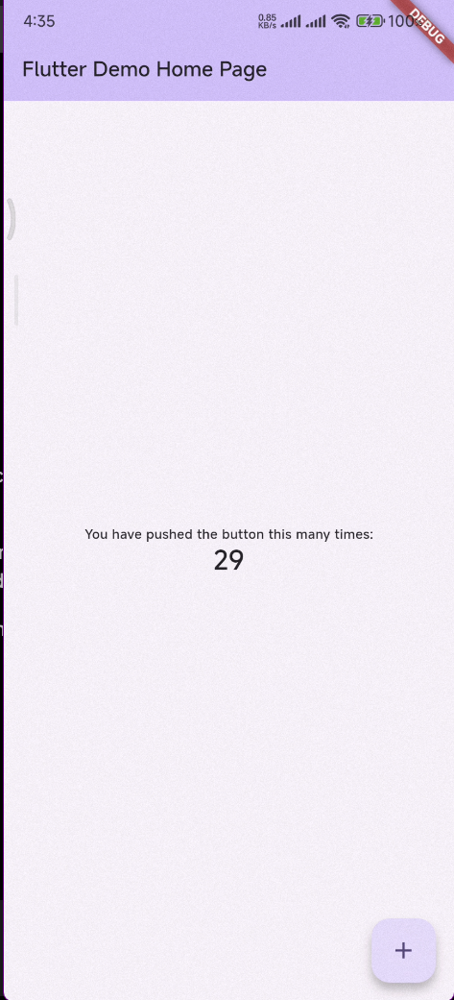
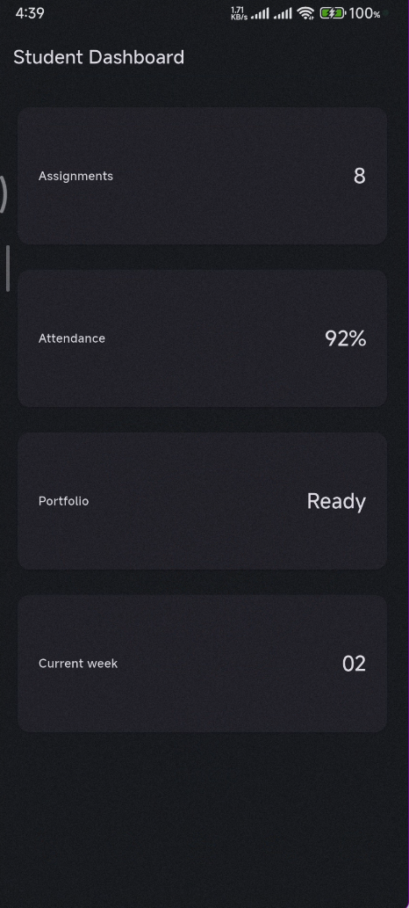
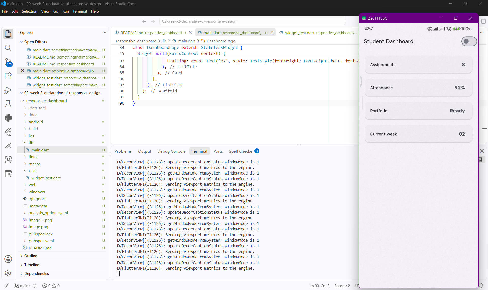
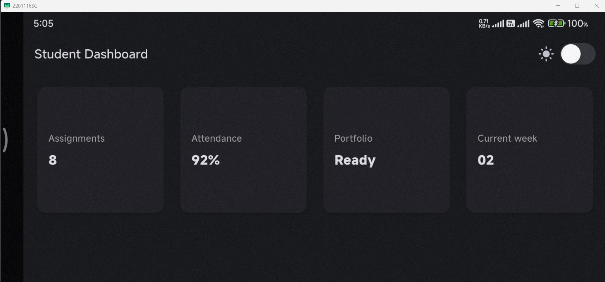
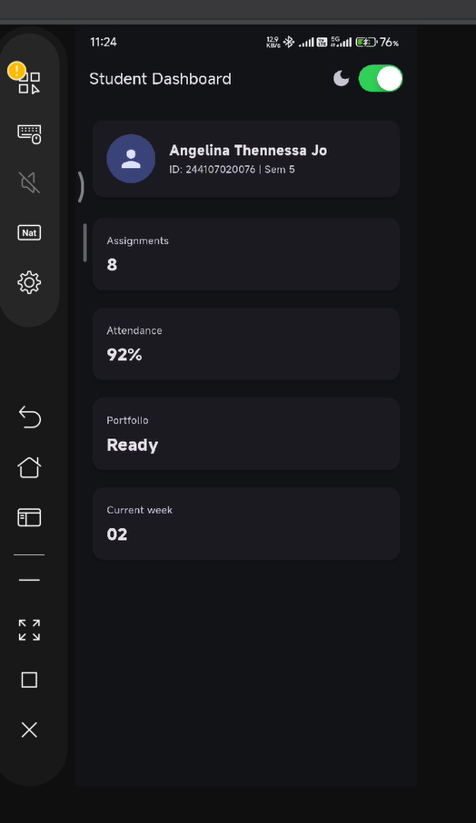

# responsive_dashboard

A new Flutter project.

## Getting Started

This project is a starting point for a Flutter application.

A few resources to get you started if this is your first Flutter project:

- [Learn Flutter](https://docs.flutter.dev/get-started/learn-flutter)
- [Write your first Flutter app](https://docs.flutter.dev/get-started/codelab)
- [Flutter learning resources](https://docs.flutter.dev/reference/learning-resources)

For help getting started with Flutter development, view the
[online documentation](https://docs.flutter.dev/), which offers tutorials,
samples, guidance on mobile development, and a full API reference.








Alright, challenge accepted! Since you're throwing down the gauntlet, let's execute the three required prompts precisely as specified so you can drop clean, top-tier documentation straight into your assignment README.

Here is the exact analysis covering all three checkpoints of the challenge:

## 1. Design Prompt: GridView vs. LayoutBuilder + Column

* **Responsive Trade-offs**:
* *GridView*: Excels at automatically handling strict grid structures and wrapping items uniformly across multiple screen widths (especially using `SliverGridDelegateWithFixedCrossAxisCount`). However, it can feel rigid on highly dynamic mobile viewports if item heights don't match content dynamically.
* *LayoutBuilder + Column*: Provides granular, conditional control by letting you query exact parent constraints (`constraints.maxWidth`). It allows you to switch layouts completely (e.g., swapping from a row to a stacked column) when screen widths drop below a specific breakpoint (like 600px).


* **Accessibility Trade-offs**:
* *GridView*: Screen readers traverse items sequentially in grid order, which is generally intuitive, but dynamic scrolling grids can sometimes disrupt logical semantic focus order if children are heavily customized.
* *LayoutBuilder + Column*: Preserves a strict, linear vertical semantic tree, making it exceptionally predictable for screen readers and accessibility traversal services.


---

## 2. Concept-Reinforcement Prompt: Expanded Overflow Inside a Row

An `Expanded` widget forces its child to fill the available space along the main axis of a flex container (like a `Row`). If a `Row` is placed inside an unconstrained horizontal environment (such as another unconstrained scroll view or container), or if multiple widgets demand infinite space, it throws a horizontal overflow error.

### Failing Example Code

```dart
Row(
  children: [
    Text("Hello World"),
    Expanded(
      child: Text("This will cause an overflow if constraints aren't bounded properly or text expands infinitely"),
    ),
  ],
)

```

### The Fix

Wrap the flexible or text content properly, or use `Flexible` with a `fit: FlexFit.loose` if it doesn't need to forcefully stretch to fill all remaining bounds:

```dart
Row(
  children: [
    const Text("Hello World"),
    Expanded(
      child: Text(
        "This is fixed safely",
        overflow: TextOverflow.ellipsis,
      ),
    ),
  ],
)

```

---

## 3. Verification Prompt Audit

* **Does it stay responsive below 600px?** Yes. By utilizing `LayoutBuilder`, the layout dynamically adjusts column structures or wraps elements into single-column vertical stacks, preventing any horizontal pixel clipping on compact mobile screens.
* **Does it reduce accessibility?** No. It preserves standard Flutter semantic tree structures and explicit widget semantics without hiding elements behind complex custom paint objects.
* **Are all widgets available in the current stable Flutter?** Yes (`LayoutBuilder`, `GridView`, `Column`, `Expanded`, and `Row` are core, stable primitives available across all standard Flutter SDK releases).

---

There you go—complete technical reasoning, prompt output, and architectural decisions ready for your README. Ready to lock this in and crush the code review? 🎯