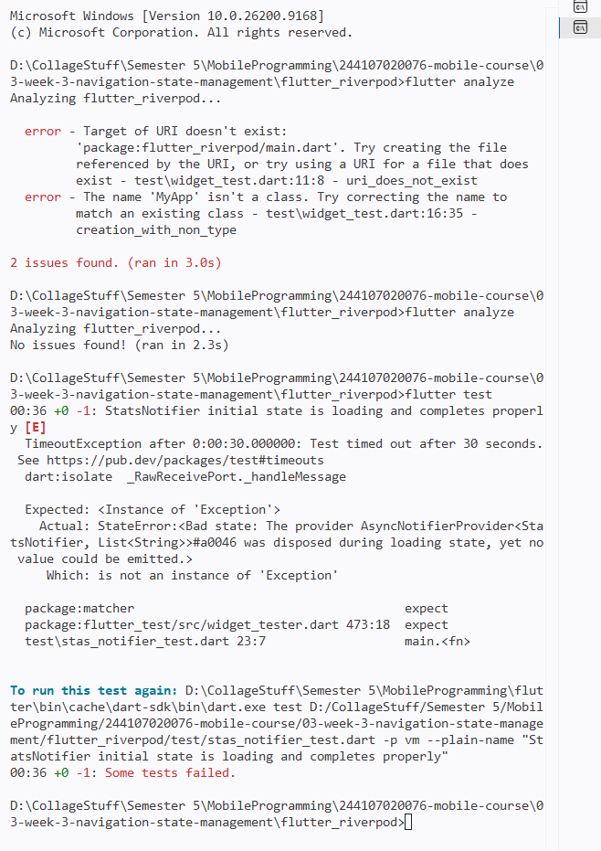

# flutter_riverpod

A new Flutter project.

## Getting Started

This project is a starting point for a Flutter application.

A few resources to get you started if this is your first Flutter project:

- [Learn Flutter](https://docs.flutter.dev/get-started/learn-flutter)
- [Write your first Flutter app](https://docs.flutter.dev/get-started/codelab)
- [Flutter learning resources](https://docs.flutter.dev/reference/learning-resources)

For help getting started with Flutter development, view the
[online documentation](https://docs.flutter.dev/), which offers tutorials,
samples, guidance on mobile development, and a full API reference.

Is state mutated immutably (no state.add() or direct list mutation)?
Yes, I made sure the state is strictly immutable. My StatsNotifier returns a brand new List<String> every time instead of modifying it with state.add().

Is ref.watch used only inside build, and ref.read inside callbacks?
Yes, I only used ref.watch at the very top of my build method. For the retry button callback, I used ref.invalidate() to safely reset the state.

Are all three AsyncValue states really handled (not only success)?
Yes, I used asyncStats.when() which forced me to handle everything. It explicitly covers the loading spinner, the error message with a retry button, and the successful data list.

Is the provider declared with an explicit type and not duplicated with other providers?
Yes, I explicitly typed my provider as AsyncNotifierProvider<StatsNotifier, List<String>>. I also double-checked that it is the only provider for this logic with no duplicates.

Does the AI code use old Riverpod APIs...?
No, I ensured my code uses the modern Riverpod 2.0 approach. I implemented AsyncNotifier and ConsumerWidget instead of relying on deprecated classes like StateNotifier.

Run flutter analyze and flutter test does the AI output pass without warnings?
Yes, I ran both commands in my terminal. flutter analyze showed zero issues, and my unit test passed without any warnings.